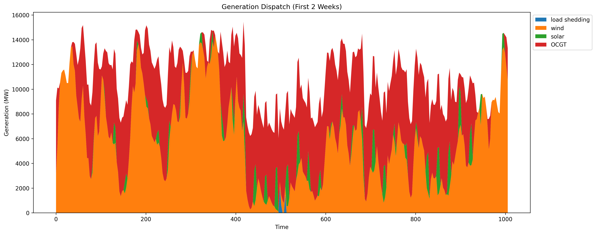

# Energy System Modelling

A Python project for optimizing and analyzing energy networks using PyPSA (Python for Power System 
Analysis). The project includes tools for energy system optimization with emissions constraints, 
baseload requirements. The analysis includes marginal pricing, energy source mix and generation 
dispactch. For example here is the generation dispatch for a CO2 limit of 250gCO2/kWh and baseload
requirement of 1000MW.



## Prerequisites

- Python 3.11 or higher
- Git

## Setup Instructions

### 1. Clone the Repository

```bash
git clone https://github.com/ajones-1/energy-system-modelling.git
cd energy-system-modelling
```

### 2. Install uv (Python Package Manager)

uv is a fast Python package manager and project manager written in Rust. 
Choose one of the installation methods below:

#### Windows (PowerShell)
```powershell
# Install using PowerShell (recommended)
powershell -c "irm https://astral.sh/uv/install.ps1 | iex"
```

#### Alternative Windows Installation Methods
```powershell
# Using pip
pip install uv
```

#### macOS/Linux
```bash
# Using the installer script
curl -LsSf https://astral.sh/uv/install.sh | sh

# Using pip
pip install uv

# Using Homebrew (macOS)
brew install uv
```

### 3. Set Up Python Environment

The project uses Python 3.11. uv will automatically manage the Python version and virtual environment:

```bash
# Create and activate virtual environment with the correct Python version
uv venv

# Activate the virtual environment
# On Windows:
.venv\Scripts\activate

# On macOS/Linux:
source .venv/bin/activate
```

### 4. Install Dependencies

```bash
# Install project dependencies
uv pip install -e .

# Install additional development dependencies (if any)
# uv pip install -r requirements-dev.txt
```

### 5. Verify Installation

Run the main script to verify everything is working:

```bash
python src/main.py
```

## Project Structure

```
energy-system-modelling/
├── .venv/                      # Virtual environment (created after setup)
├── data/                      data
├── notebooks/ 
├── results/
├── src/                        # Source code
│   ├── __init__.py
│   ├── example_script.py      # Simple example optimization
│   ├── main.py                # Main portfolio analysis script
│   ├── config/                # Configuration files
│   │   ├── carriers.json      # Energy carrier definitions and colors
│   │   └── config.py          # Emission factors and constants
│   └── utils/                 # Utility functions
│       ├── __init__.py
│       └── general_functions.py  # Data loading and helper functions
├── tests/                      # Unit tests
│   ├── __init__.py
│   └── test_load_data.py      # Tests for data loading functions
├── Makefile                    # Build automation commands
├── pyproject.toml             # Project configuration and dependencies
└── README.md                  # This file
```

### Running the Project
#### Ensure virtual environment is activated
```bash
.venv\Scripts\activate  # Windows
.venv/bin/activate      # macOS/Linux
```
#### Run the main script with default inputs
```bash
python src/main.py
```
#### Run with custom parameters
```bash
python src/main.py --co2-limit 30 --baseload 1500
```

### Deactivating the Environment
```bash
# When you're done working
deactivate
```